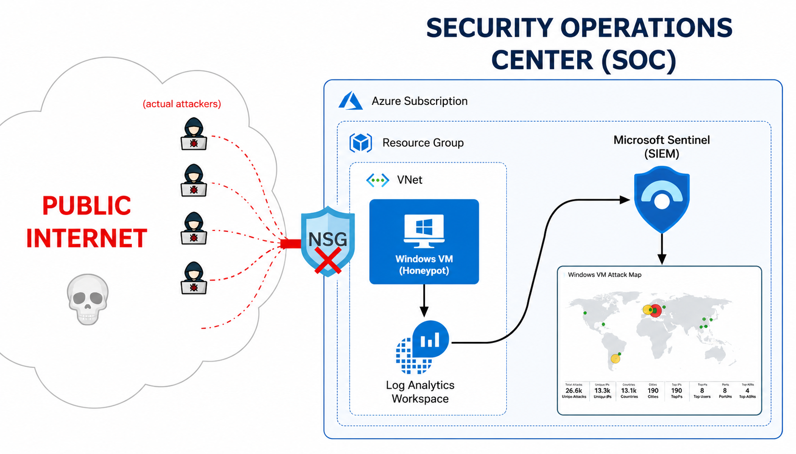
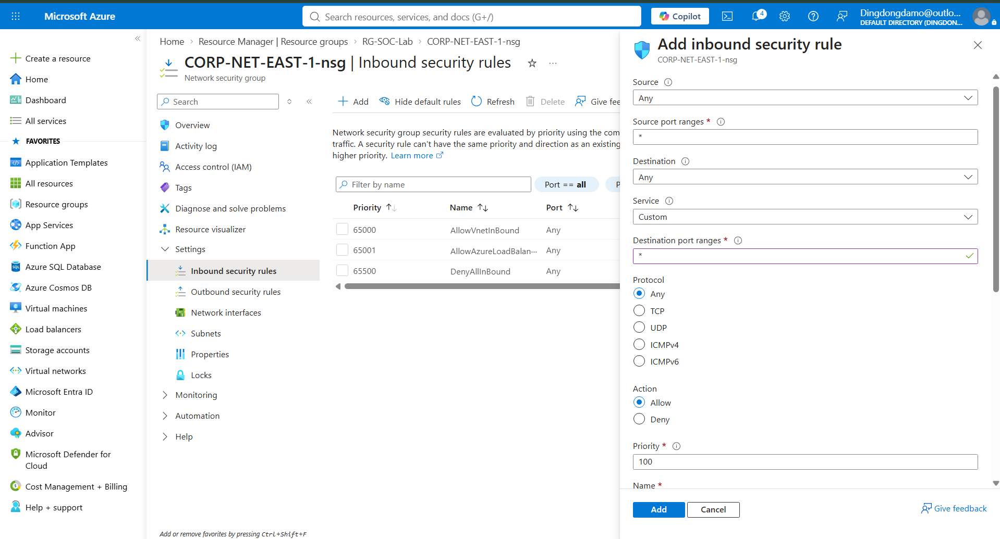
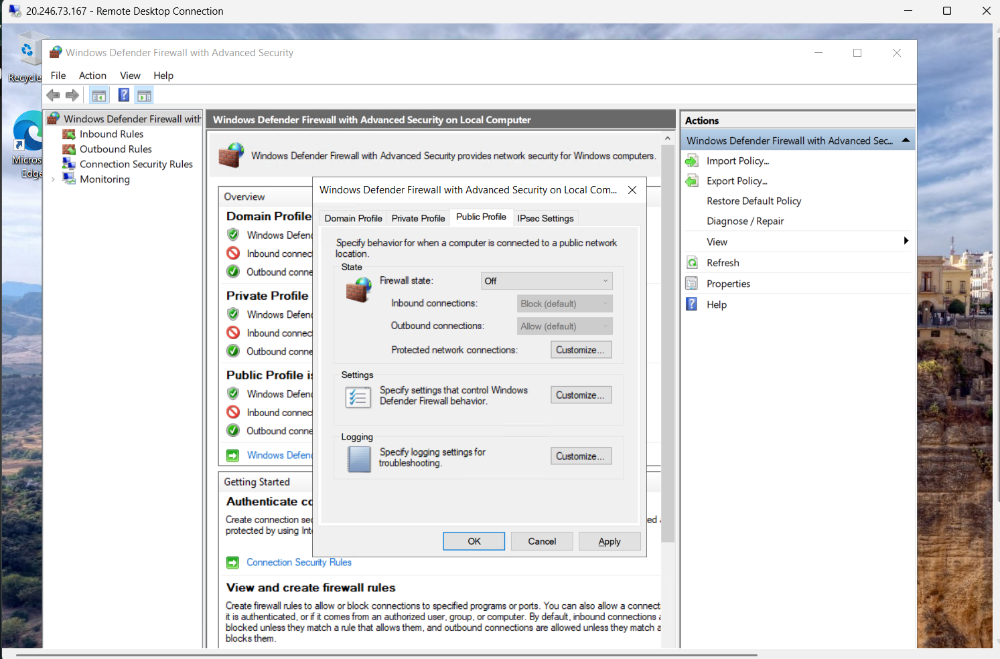
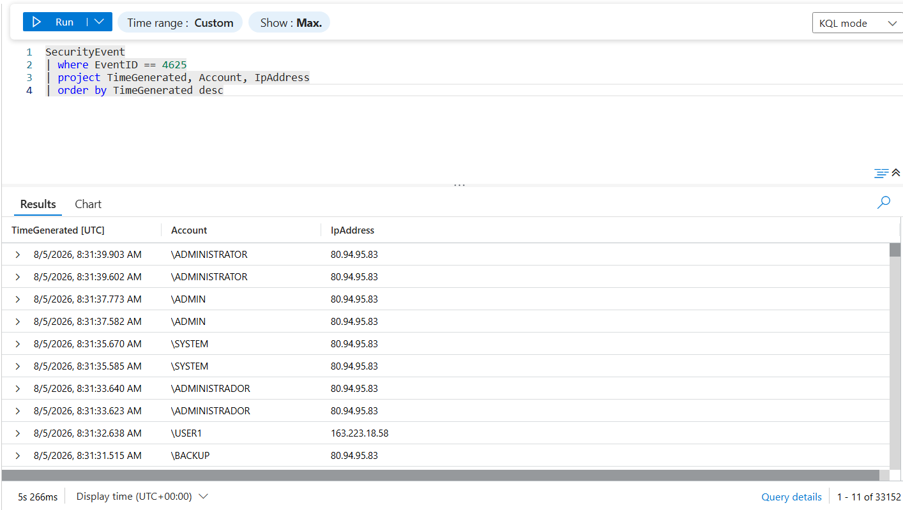
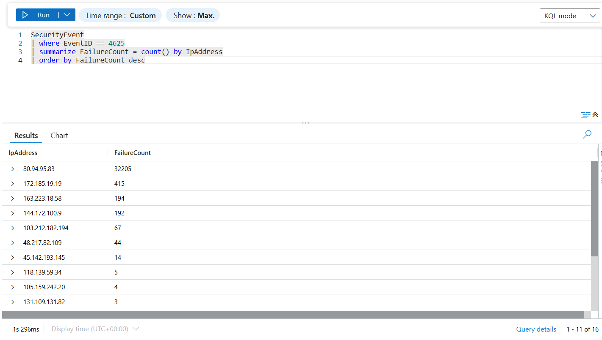
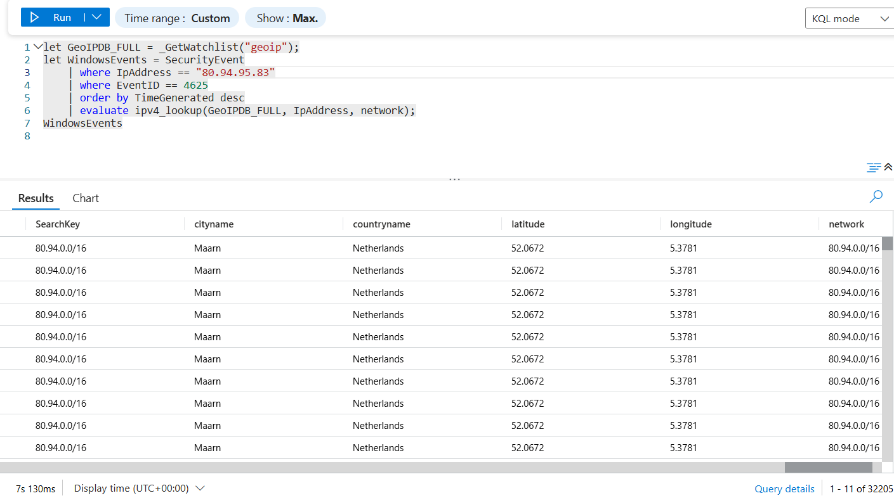
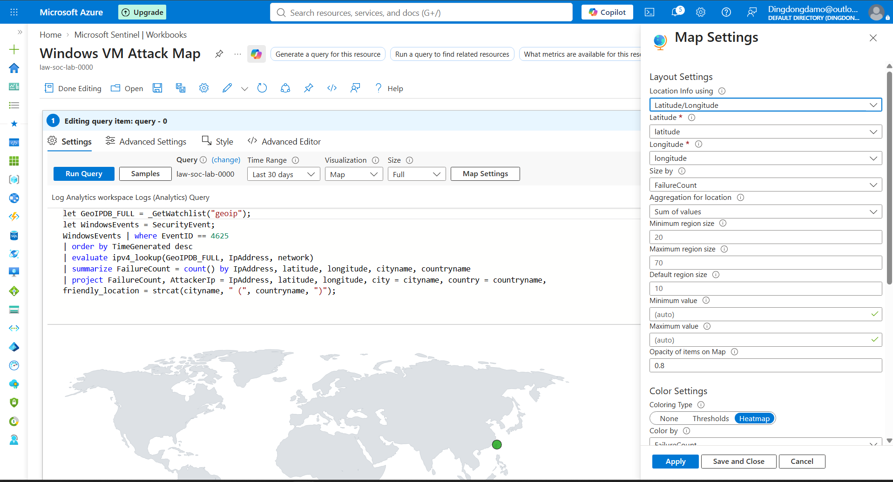
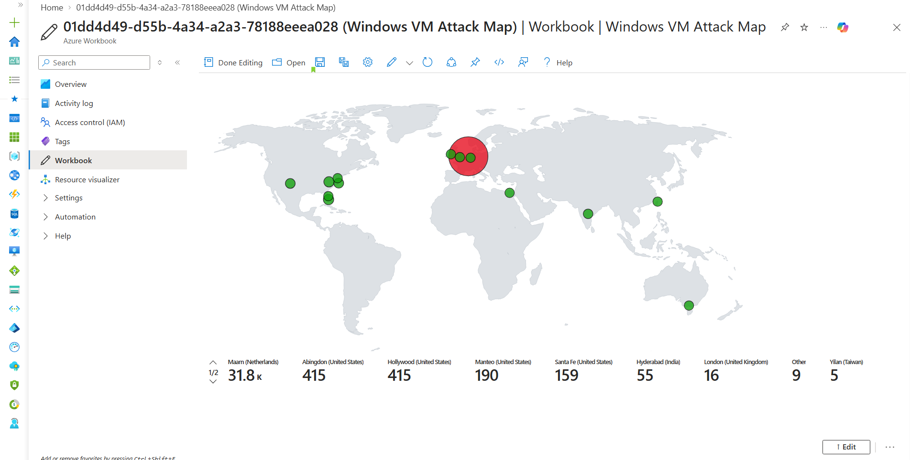

# Azure Sentinel Honeypot Lab

## Overview

This project demonstrates the deployment of a deliberately exposed Windows virtual machine in Microsoft Azure to observe failed authentication attempts and analyse the resulting security events using Microsoft Sentinel.

A Windows VM was configured as a honeypot and exposed to the internet through an Azure Network Security Group (NSG). Windows security events were collected using Azure Monitor and sent to a Log Analytics workspace, where Microsoft Sentinel was used to query and visualise failed authentication attempts.

The lab demonstrates concepts including cloud networking, security event collection, SIEM analysis, Kusto Query Language (KQL), IP geolocation and security monitoring.

---

## Architecture



### Data Flow

```text
Internet
   │
   ▼
Azure Public IP
   │
   ▼
Network Security Group
   │
   ▼
Windows Virtual Machine
   │
   │ Windows Security Events
   ▼
Azure Monitor Agent
   │
   ▼
Log Analytics Workspace
   │
   ▼
Microsoft Sentinel
   │
   ▼
KQL Analysis
   │
   ▼
GeoIP Watchlist Enrichment
   │
   ▼
Sentinel Workbook
   │
   ▼
Geographic Attack Map
```

---

## Technologies 

- Remote Desktop Protocol (RDP)
- Microsoft Azure
- Windows 10
- Microsoft Sentinel
- Azure Log Analytics
- Azure Monitor Agent
- Azure Network Security Groups
- Windows Event Viewer
- Kusto Query Language (KQL)
- GeoIP Watchlist

---

## Lab Objectives

The objectives of this project were to:

- Deploy a Windows virtual machine in Microsoft Azure.
- Configure the VM as an intentionally exposed honeypot.
- Collect Windows security events in Azure.
- Identify failed authentication attempts using Event ID 4625.
- Analyse security events using KQL.
- Enrich source IP addresses with geographic information.
- Visualise failed authentication activity using a Microsoft Sentinel Workbook.

---

## 1. Azure Virtual Machine Deployment

A Windows virtual machine was deployed in Microsoft Azure with a public IP address.

The public IP allowed the VM to receive connections from the internet and provided a controlled environment in which authentication activity could be observed.

VM notable settings:
- Image: Windows 10 Enterprise, version 22H2 - x64 Gen2
- Size: Standard D2as v6 - 2vcpus, 8GiB memory
- Delete public IP and NIC when VM is deleted: True
- Boot diagnostic: Disable

---

## 2. Network Configuration

An Azure Network Security Group was configured with a permissive inbound rule to deliberately expose the lab VM to unsolicited internet traffic.

The Windows Defender Firewall profiles were also disabled for the duration of the experiment.

<br>


These settings intentionally reduce the security of the VM and were used only because the system was an isolated honeypot containing no sensitive information.

> **NOTE:** In a production environment, inbound access should instead follow the principle of least privilege, with only required ports and trusted sources permitted.

---

## 3. Security Event Collection

An Azure Monitor Agent was configured to collect Windows security events from the VM and forward them to an Azure Log Analytics workspace (LAW).

Microsoft Sentinel was then connected to the workspace to provide SIEM capabilities for analysing the collected events.

To verify that the logging pipeline was functioning correctly, failed authentication attempts were intentionally generated against the VM via RDP.

Windows recorded these attempts as:

**Event ID 4625 — An account failed to log on**

The events were successfully observed in the LAW, confirming that the collection pipeline was functioning.

---

## 4. Analysing Failed Authentication Attempts

The following KQL query was used to identify failed Windows logon attempts:

```kusto
SecurityEvent
| where EventID == 4625
| project TimeGenerated, Account, IpAddress
| order by TimeGenerated desc
```

This provided the timestamp, targeted account and source IP address associated with each failed authentication attempt.



Another query can be used to identify the IP addresses responsible for the greatest number of failures:

```kusto
SecurityEvent
| where EventID == 4625
| summarize FailureCount = count() by IpAddress
| order by FailureCount desc
```



---

## 5. IP Geolocation

A [GeoIP dataset](https://raw.githubusercontent.com/joshmadakor1/lognpacific-public/refs/heads/main/misc/geoip-summarized.csv ) was imported into Microsoft Sentinel as a watchlist.

The watchlist maps IP address ranges to geographic information including:

- Country
- City
- Latitude
- Longitude

We can now use this watchlist to enrich our queries with geographic information. The following KQL query demonstrates the `ipv4_lookup` function that is used to match source IP addresses from failed Windows logon events against IP address ranges in the GeoIP watchlist.

```kusto
let GeoIPDB_FULL = _GetWatchlist("geoip");
let WindowsEvents = SecurityEvent
    | where IpAddress == <attacker IP address>
    | where EventID == 4625
    | order by TimeGenerated desc
    | evaluate ipv4_lookup(GeoIPDB_FULL, IpAddress, network);
WindowsEvents
```

Below is the result of when I inputted an unsolicited source IP into the above query:



> We can see that the results now include cityname, countryname, latitude, longitude attributes.

---

## 6. Attack Map

[The query](#kql-query):

1. Retrieves Windows Event ID 4625 events.
2. Uses the source IP address associated with each failed logon event.
3. Looks up the IP address in the GeoIP watchlist.
4. Determines the approximate latitude, longitude, city and country.
5. Counts failed authentication attempts by source.
6. Ultimately produces an enriched/aggregated dataset.

A Microsoft Sentinel Workbook was then configured to display failed authentication attempts geographically.



> The size and colour of map markers represent the number of failed authentication attempts associated with each location.

The map configuration file, which also contains the [main KQL query](#kql-query) is available [here](workbook/map.json)


---

## KQL Query

The KQL query used for GeoIP enrichment and map visualisation:

```kusto
let GeoIPDB_FULL = _GetWatchlist("geoip");
let WindowsEvents = SecurityEvent;

WindowsEvents | where EventID == 4625
| order by TimeGenerated desc
| evaluate ipv4_lookup(GeoIPDB_FULL, IpAddress, network)
| summarize FailureCount = count() by IpAddress, latitude, longitude, cityname, countryname
| project FailureCount, AttackerIp = IpAddress, latitude, longitude, city = cityname, country = countryname,
friendly_location = strcat(cityname, " (", countryname, ")");
```

---

## Results

After the honeypot was exposed to the internet, the VM began receiving unsolicited failed authentication attempts from external IP addresses.

Windows recorded these attempts as Security Event ID 4625, and the events were successfully collected by Azure Monitor and forwarded to the Log Analytics workspace for analysis in Microsoft Sentinel.

KQL was used to identify the source IP addresses and count the number of failed authentication attempts. These addresses were then correlated with the GeoIP watchlist to determine their approximate geographic locations.

The resulting data was visualised using a Microsoft Sentinel Workbook, providing a geographic representation of the observed authentication activity.

This lab demonstrated the complete monitoring pipeline:<br>
**Internet traffic → Windows security events → Azure Monitor → Log Analytics → Microsoft Sentinel → KQL analysis → GeoIP enrichment → visualisation**

### Observations

Initially, only manually generated test events appeared in the logs. These were used to verify that Windows auditing, Azure Monitor and Log Analytics were functioning correctly. After the VM remained exposed, genuine unsolicited authentication attempts from external IP addresses began appearing. 

**Attack activity after approximately 22 hours of exposure:**<br>


Additional metrics derived from the Log Analytics Workspace:
| Metric                     |     Result |
| -------------------------- | ---------: |
| Total failed logons        |          33152 |
| Unique external source IPs |          16 |
| Highest-volume source      | 32205 attempts |
| Most targeted username     |          ADMIN |

>A single source IP accounted for 32,205 of the 33,152 failed logon attempts observed, approximately 97.1%, indicating that the majority of activity originated from one high-volume source.

The results also highlight the security risk associated with exposing remote administration services directly to the internet and the importance of restrictive network controls, strong authentication and continuous security monitoring.

---

## Skills Demonstrated

- Microsoft Azure administration
- Cloud networking
- Network Security Groups
- Windows security auditing
- SIEM configuration
- Microsoft Sentinel
- Azure Monitor
- Log Analytics
- Kusto Query Language
- Security event analysis
- Log enrichment and visualisation
- Basic honeypot deployment

---

## References

This project was based on and adapted from Josh Madakor's Microsoft Sentinel honeypot lab tutorial on YouTube.

- Josh Madakor — [Microsoft Sentinel Tutorial / Honeypot Lab](https://www.youtube.com/watch?v=g5JL2RIbThM&list=PLqBeiU46hx1H--SNfTrohTOWeqkK-M2Y0&index=12)
- Microsoft Learn documentation for Microsoft Sentinel, Azure Monitor and Kusto Query Language

The implementation, documentation, analysis and screenshots in this repository reflect my own lab environment and observations.
